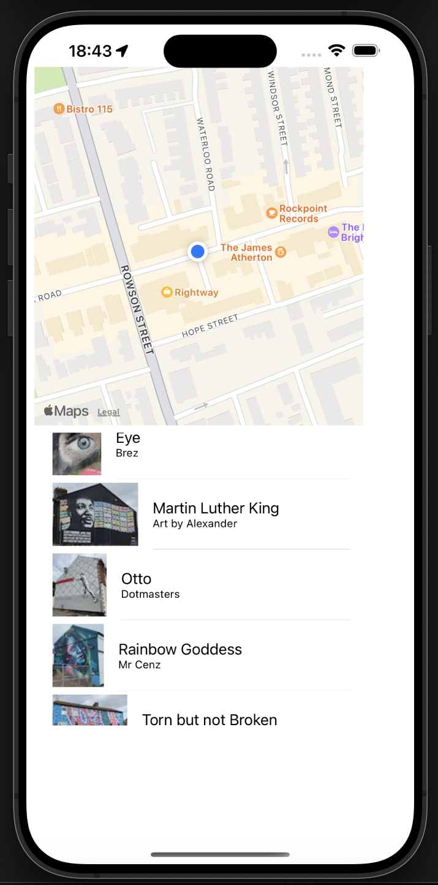
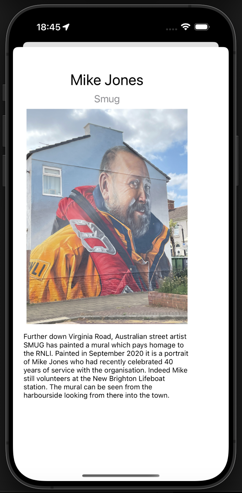

# Projects

## Project 1

Mural Finding App

A mobile application designed to showcase and explore murals located in New Brighton. The app allows users to view details about each mural, including images, artist information, and additional data. It also integrates location services to display murals on a map and sorts them based on their proximity to the user.

iOS Development: Swift

Technologies Used:

 UIKit: For user interface components   Core Data: For local data persistence
  MapKit: For displaying murals on a map and user location
  URLSession: For network requests to fetch mural data
  JSONDecoder: For parsing JSON data
  NSCache: For caching images and data 

 

 Key Features:
 - Displays detailed information about a selected mural, including an image, title, artist, and additional information.
 - Shows the user’s current location and nearby murals on a map, allowing for easy exploration of murals based on proximity.
 - Data Fetching and Caching: Retrieves mural data from a web service, caches images and data to improve performance, and saves the data using Core Data for offline access.
 - Updates mural information based on user interaction and changes in location.

[GitHub Repository](https://github.com/username/project1)

## Project 2

Top-Down Unity Game

This project involves developing a top-down game in Unity, focusing on creating immersive gameplay through emergent realism. The game centres around a prisoner defeating prison guards in order to escape a maximum-security facility. It is a 2D top-down shooter game where the player must find ways to outsmart prison guards. The game showcases essential game design principles where players will navigate a dynamic setting filled with action and challenges and includes features such as collision detection and AI opponents. These opponents aim to mimic human-like tactical behaviour in order to create an immersive and engaging gameplay experience. 

Project Link: https://liverpool.instructuremedia.com/embed/51ca57c9-b36d-468d-9c52-57825fc869cc

[GitHub Repository](https://github.com/username/project2)
